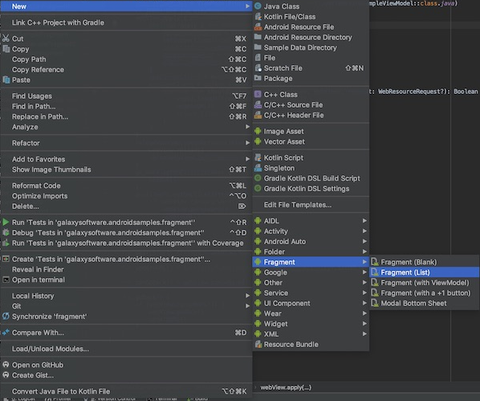

# Použitie fragmentov

Nasledujúca časť bude venovaná problematike fragmentov a úprave aplikácie tak aby využívala dva fragmenty pričom jeden bude zobrazovať zoznam receptov a druhý zobrazí detail receptu.

```plantuml format="svg" classes="uml myDiagram" alt="class diagram" title="Diagram rozhrania" width="300px" 
skinparam Activity {
    	ArrowColor #000000
    	ArrowThickness 1
    	AttributeFontColor	#004D40
    	BackgroundColor	#ECECFF
    	BorderColor	#ccf
    	FontColor #000000
    	HeaderBackgroundColor  #eaeafa
    	StereotypeFontColor	#009688
    }
    skinparam roundcorner 10
    skinparam shadowing false
    
!definelong SALT(x)
"{{
salt
_##x
}}
" as x
!enddefinelong

!definelong _main
{+
<b>main_layout.xml
==
FrameLayout
}
!enddefinelong

!definelong _list
{+
<b>recycler_list_layout 
==
+ Recept1
--
+ Recept2
--
+ Recept3
--
+ Recept4
--
+ Recept5
}
!enddefinelong

!definelong _detail
{+
<b>fragment_detail
==
{^"Image"
<b>------RecipeImage------       
}
--
+Ingrediencie
+Ingrediencie
+Ingrediencie
+Ingrediencie
--
Priprava receptu
}
!enddefinelong

(*) --> SALT(main)
If "zobraz detail receptu?" then
-->[Nie] SALT(list)
else
--> SALT(detail)
```


## 1. ListFragment 

Tento fragment preberie funkcionalitu ako mala doteraz hlavna aktivita tj. zobraziť v `Recyclerview`  zoznamom receptov.

**Vytvorte nový fragment (Blank)** 
- Názov triedy: `ListFragment`
- Vyberte typ fragmentu blank




### 1.1 Layout fragmentu

Layout fragmentu použijeme rovnaky ako bol použitý v hlavnej aktivite. 

**`ListFragment.java`:**

```java hl_lines="5"
...
@Override
public View onCreateView(LayoutInflater inflater, ViewGroup container,
                         Bundle savedInstanceState) {
    return inflater.inflate(R.layout.recycler_list_layout, container, false);

}
...
```

### 1.2 RecylerView

Do metódy `onActivityCreated` presunieme funkcionalitu z metódy `onCreate`, ktorá je súčastou  `MainActivity.java`. 

!!! info
    Metóda `onActivityCreated` v životnom cykle nasleduje po metóde `onCreateView`. Je garantované, že pri volaní tejto metódy je asociovaná aktivita už vytvorená.  


```java hl_lines="4 16 17"
@Override
public void onActivityCreated(@Nullable Bundle savedInstanceState) {
 super.onActivityCreated(savedInstanceState);
 RecyclerView recyclerView = getView().findViewById(R.id.listRecyclerView);

 // use this setting to improve performance if you know that changes
 // in content do not change the layout size of the RecyclerView
 recyclerView.setHasFixedSize(true);

 // use a linear layout manager
 RecyclerView.LayoutManager layoutManager = new LinearLayoutManager(getContext());
 recyclerView.setLayoutManager(layoutManager);

 // specify an adapter (see also next example)
 MyRecipeRecyclerViewAdapter mAdapter;
 mAdapter = new MyRecipeRecyclerViewAdapter(RecipesDataSet.getRecipes(getContext()), (MainActivity) getActivity());
 recyclerView.setAdapter(mAdapter);
}
```

Vo vyznačených riadkoch nastali nasledovné zmeny: 

1. `findViewById` nie je súčasťou fragmentu, ale je súčasťou vytvoreného UI, ktorého inštanciu získate pomocou `getView()`metódy.
2. `Context` aplikácie sa získa pomocou metódy `getContext` a inštanciu asociovanej aktivity pomocou`getActivity()`

## 2. Detail fragment

Rovnakým spôsobom ako `ListFragment` vytvorte nový fragment s názom `DetailFragment`.

### 2.1 Layout fragmentu

**`DetailFragment.java`:**

```java
@Override
public View onCreateView(LayoutInflater inflater, ViewGroup container,
                             Bundle savedInstanceState) {
    // Inflate the layout for this fragment
    return inflater.inflate(R.layout.fragment_detail, container, false);
}
```

### 2.2 Factory metóda

Na odoslanie potrebných dát do fragmentu sa využíva objekt typu `Bundle` , ktorý je odovzdaný novo vytvorenému fragmentu pomocu metódy `setArguments` . Fragment k danému objektu može pristúpiť pomocou metódy `getArguments`. Tento `Bundle` objekt je spravovany operačným systémom. Daný mechanizus sa vyžíva vzhľadom na fakt, že fragment môže mať iba bezparametrický konštruktor pomocou ktorého operačný systém reinicializuje fragment pri reštarte aplikácie v dôsledku konfiguračnej zmeny(napr. rotacia obrazovky) . 

Na vytvorenie nove inštancie fragmentu sa často používa tz. factory metóda: 

**`DetailFragment.java`:**

```java
public class DetailFragment extends Fragment {

    private int position;
    private static final String POS_TAG = "POSITION";

    public DetailFragment() {

    }
	// Factory metoda
    public static DetailFragment createDetailFragment(int position) {
        DetailFragment detailFragment = new DetailFragment();
        Bundle bundle = new Bundle();
        bundle.putInt(POS_TAG, position);
        detailFragment.setArguments(bundle);
        return detailFragment;
    }

    @Override
    public void onCreate(@Nullable Bundle savedInstanceState) {
        super.onCreate(savedInstanceState);

        // Load position from arguments
        assert getArguments() != null;
        position = getArguments().getInt(POS_TAG, 0);
    }

    @Override
    public View onCreateView(LayoutInflater inflater, ViewGroup container,
                             Bundle savedInstanceState) {
        // Inflate the layout for this fragment
        return inflater.inflate(R.layout.fragment_detail, container, false);
    }

    @Override
    public void onActivityCreated(@Nullable Bundle savedInstanceState) {
        super.onActivityCreated(savedInstanceState);

        ImageView img = getView().findViewById(R.id.detailImage);
        TextView title = getView().findViewById(R.id.recipeTitle);
        TextView detail = getView().findViewById(R.id.recipeDetail);
        TextView ingredients = getView().findViewById(R.id.recipeIngred);

        Recipe recipe = RecipesDataSet.getRecipes(getContext()).get(position);

        img.setImageBitmap(recipe.getBitmapFromAsset());
        title.setText(recipe.title);
        detail.setText(recipe.detail);

        String ingred = TextUtils.join("\n\r", recipe.ingredients);
        ingredients.setText(ingred);
    }
}
```

## 3. Úprava MainActivity

Na vytvorenie fragmentu používame `FragmentManager`, ktorý získame pomocu metódy `getSupportFragmentManager` alebo `getFragmentManager` záleží či používame fragment zo support knižnice (resp. androidX). 

`MainActivity.java`
```java
public class MainActivity extends AppCompatActivity implements MyRecipeRecyclerViewAdapter.OnRecipeListInteraction {

    @Override
    protected void onCreate(Bundle savedInstanceState) {
        super.onCreate(savedInstanceState);
        setContentView(R.layout.main_layout);

        // Testovanie či už fragmenty neexistujú
        if ((getSupportFragmentManager().findFragmentByTag("detailFragment") == null)
                && (getSupportFragmentManager().findFragmentByTag("listFragment") == null)) {

            getSupportFragmentManager().beginTransaction()
                    .replace(R.id.fragment_container, new ListFragment(), "listFragment")
                    .commit();
        }


    }

    // Vytvorenie detail fragmentu
    @Override
    public void onRecipeClick(int position) {
        getSupportFragmentManager().beginTransaction()
                .replace(R.id.fragment_container, DetailFragment.createDetailFragment(position), "detailFragment")
                .addToBackStack(null) // Ulozenie do zasobnika fragmentov 
                .commit();
    }

}
```

### Reštarovanie aplikácie vplyvom konfiguračných zmien
Vzhľadom na životný cyklus aplikácie a takisto vplyvom konfiguračných zmien treba uvažovať ako správne spracovať reštartovanie aplikácie. Ako vieme po reštarte aplikácie začína životný cyklus zavolaním  metódy `onCreate` v ktorej sa inicializuje hlavný fragment `ListFragment`. Každý pripojený fragment k aktivite prechádza tiez reštartom, ktorý následne vyústi do stavu, kedy je fragment systémom nanovo vytvorený a zobrazený v rodičovskom kontajneri. V tomto prípade treba ošetriť aby sme v métode `onCreate` hlavnej aktivity opätovne nevytvorili nový fragment. To sa dá zabezpečit nájdením inštanci existujúceho fragmentu. 


```java
getSupportFragmentManager().findFragmentByTag("listFragment")
```

!!! note "Tag"
    Fragment je identifikovaný pomocu `Tag` tzv. menovky, ktorú sme určili pri transakcii fragmentu.

