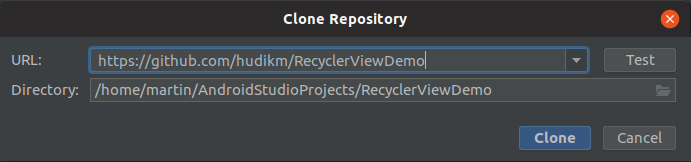
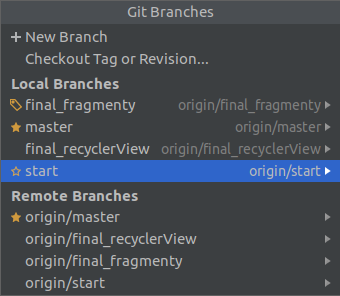

# Vytvorenie nového projektu

Naklonovanie projektu z GIT repozitára. 

**`File--> New--> Projetc from Version Control--> Git`**



Url: <https://github.com/hudikm/RecyclerViewDemo>

**Po naklonovaní prepnite na branch: `start`**

**`VCS--> Git--> Branches`**



## Obsah projektu

### Java triedy

```
./main/java/sk/fri/uniza/recyclerviewdemo/model/Recipe.java
./main/java/sk/fri/uniza/recyclerviewdemo/model/RecipesDataSet.java
./main/java/sk/fri/uniza/recyclerviewdemo/utilities/LoadData.java
./main/java/sk/fri/uniza/recyclerviewdemo/MainActivity.java
```

Package `./main/java/sk/fri/uniza/recyclerviewdemo/model` prístup k vygenerovaným dátam o receptoch.

#### Trieda `RecipesDataSet.java`

Obsahuje metódu: 

`public static List<Recipe> getRecipes(Context context)`

Slúži na získanie uložených receptov

 * **Parameters:** `context` — aplikačný kontext
 * **Returns:** list načítaných receptov

#### Trieda `Recipe.java`

Datová trieda receptu

#### Trieda `/utilities/LoadData.java`

Pomocná trieda na načítanie receptov. *Priamo sa nepoužíva!*

### Android Resource súbory

Layout súbory pre zobrazenie receptu

```
./main/res/layout/fragment_recipe_item.xml
./main/res/layout/fragment_recipe_item_cardview.xml
```
Layout súbory aktivit a fragmentov

```
./main/res/layout/fragment_detail.xml
./main/res/layout/recycler_list_layout.xml
./main/res/layout/main_layout.xml
```

