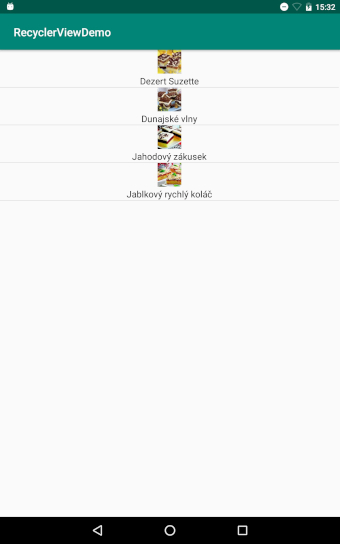

# Kľučové kroky:

Použitie RecyclerView má nasledujúce kľúčové kroky:

1. Pridajte podpornú knižnicu RecyclerView do súboru `build.gradle (module)`

2. Definujte triedu model, ktorá  bude použitá ako zdroj údajov

3. Pridajte do svojej aktivity RecyclerView

4. Vytvorte si vlastný XML layout súbor ako má vyzerať riadok na zobrazenie jednej položky

5. Vytvorte `RecyclerView.Adapter` a `ViewHolder` na vykreslenie položky

6. Pripojte adaptér zo zdrojom údajov a nasledne ho odovzdejte RecyclerView

   

## 1. Pridanie support kniznice

`app/build.gradle`

```diff
dependencies {
	...
	implementation 'com.android.support:cardview-v7:28.0.0'
    implementation 'com.android.support:support-v4:28.0.0'
    testImplementation 'junit:junit:4.12'
    androidTestImplementation 'com.android.support.test:runner:1.0.2'
    androidTestImplementation 'com.android.support.test.espresso:espresso-core:3.0.2'
+   implementation 'com.android.support:recyclerview-v7:28.0.0'
}
```

## 2. Definovanie modelu

Model je vytvorený v súbore `model/Recipe.java`

```java
public class Recipe {

    @JsonIgnore
    private static Context contex = null;
    @JsonProperty("title")
    public String title;
    @JsonProperty("ingredients")
    public List<String> ingredients = null;
    @JsonProperty("detail")
    public String detail;
    @JsonProperty("image_url")
    public String imageUrl;
    @JsonIgnore
    private Map<String, Object> additionalProperties = new HashMap<String, Object>();

    @JsonAnyGetter
    public Map<String, Object> getAdditionalProperties() {
        return this.additionalProperties;
    }

    @JsonAnySetter
    public void setAdditionalProperty(String name, Object value) {
        this.additionalProperties.put(name, value);
    }

    @JsonIgnore
    public static void setContext(Context appcontext) {
        contex = appcontext;
    }

    @JsonIgnore
    public Bitmap getBitmapFromAsset() {
        assert contex != null;
        return getBitmapFromAsset(contex);
    }

    @JsonIgnore
    public Bitmap getBitmapFromAsset(Context context) {
        AssetManager assetManager = context.getAssets();

        InputStream istr;
        Bitmap bitmap = null;
        try {
            istr = assetManager.open(imageUrl);
            bitmap = BitmapFactory.decodeStream(istr);
        } catch (IOException e) {
            e.printStackTrace();
        }

        return bitmap;
    }
}
```

## 3. Vytvorenie RecyclerView v ramci layout súbora

V súbore `./main/res/layout/recycler_list_layout.xml` vytvorte RecycleView

```xml
<?xml version="1.0" encoding="utf-8"?>
<android.support.v7.widget.RecyclerView xmlns:android="http://schemas.android.com/apk/res/android"
    xmlns:tools="http://schemas.android.com/tools"
    android:id="@+id/listRecyclerView"
    android:layout_width="match_parent"
    android:layout_height="match_parent"
    android:layout_marginStart="0dp"
    android:layout_marginEnd="2dp"
    tools:listitem="@layout/fragment_recipe_item" />
```

## 4. Vytvorenie rozloženia jedného riadku

Tento layout súbor môže byť vytvorený v `/res/layout/fragment_recipe_item.xml` a bude vykreslený pre každý riadok.

```
<?xml version="1.0" encoding="utf-8"?>
<LinearLayout xmlns:android="http://schemas.android.com/apk/res/android"
    xmlns:tools="http://schemas.android.com/tools"
    android:layout_width="match_parent"
    android:layout_height="wrap_content"
    android:clickable="true"
    android:focusable="true"
    android:foreground="?android:attr/selectableItemBackground"
    android:orientation="vertical">

    <ImageView
        android:id="@+id/smallImage"
        android:layout_width="42dp"
        android:layout_height="42dp"
        android:layout_gravity="center"
        android:scaleType="centerCrop"
        android:textAppearance="?attr/textAppearanceListItem"
        tools:srcCompat="@mipmap/ic_launcher" />

    <TextView
        android:id="@+id/contentTxt"
        android:layout_width="wrap_content"
        android:layout_height="wrap_content"
        android:layout_gravity="center"
        android:layout_marginTop="2dp"
        android:gravity="center"
        android:textAppearance="?attr/textAppearanceListItem"
        tools:text="recept xy" />

</LinearLayout>
```
## 5. Vytvorenie RecyclerView adaptéra

Pred samotným vytvorením RecyclerView adaptéra je potrebné vytvoriť pomocnú triedu ViewHolder. 

### 5.1 Trieda ViewHolder

Vytvorte nový triedu `Viewholder` , ktorá je potomkom `RecylerView.Vieholder`


!!! info
    `ViewHolder` trieda môže byť   implementovaná ako vnorená trieda priamo v triede`MyRecipeRecyclerViewAdapter`

**Viewholder zasobník UI komponentov**

Upravte `ViewHolder` triedu tak aby našla a držala inštancie UI objektov, ktoré reprezentujú riadok RecyclerView. Jeden riadok je reprezentovaný layout súborom, napr. `/layout/fragment_recipe_item.xml`

Súbor `ViewHolder.java`

```java
public class ViewHolder extends RecyclerView.ViewHolder {

    ImageView smallImageView;
    TextView contentText;

    public ViewHolder(@NonNull View itemView) {
        super(itemView);
        contentText = itemView.findViewById(R.id.contentTxt);
        smallImageView = itemView.findViewById(R.id.smallImage);
    }

}
```


### 5.2 Trieda MyRecipeRecyclerViewAdapter

Vytvorte novú triedu `MyRecipeRecyclerViewAdapter`, ktorá je potomkom `RecyclerView.Adapter<ViewHolder>`


Naimplementuj nasledovné metódy


Súbor `MyRecipeRecyclerViewAdapter.java`

```java
package sk.fri.uniza.recyclerviewdemo;

import android.support.annotation.NonNull;
import android.support.v7.widget.RecyclerView;
import android.view.ViewGroup;

public class MyRecipeRecyclerViewAdapter extends RecyclerView.Adapter<ViewHolder> {
    @NonNull
    @Override
    public ViewHolder onCreateViewHolder(@NonNull ViewGroup viewGroup, int i) {
        return null;
    }

    @Override
    public void onBindViewHolder(@NonNull ViewHolder viewHolder, int i) {

    }

    @Override
    public int getItemCount() {
        return 0;
    }
}
```

### 5.3 Získanie a uloženie zoznamu receptov

Pridajte do triedy `MyRecipeRecyclerViewAdapter`nový privátny atribút typu `List<Recipe> recipes` a následneho inicializujte ako parameter konštruktora.

```java
public class MyRecipeRecyclerViewAdapter extends RecyclerView.Adapter<ViewHolder> {

    private final List<Recipe> recipes;

    public MyRecipeRecyclerViewAdapter(List<Recipe> recipes) {
        this.recipes = recipes;
    }
    // Vrátenie veľkosti datasetu
    @Override
    public int getItemCount() {
        return recipes.size();
    }
    ...
```

### 5.4 Vytvorenie UI zobrazeného riadku

Užitvateľské rozhranie jedného riadku sa vytvára v metóde `onCreateViewHolder` za pomoci `LayoutInflater`api. Následne, vytvorené rozhranie sa odovzdá do novo vytvoreného objektu `ViewHolder`, ktorý má za úlohu nájsť a udržiavať inštantcie jednotlyvých prkov, ktoré tvoria jeden riadok.  Vytvorený objekt `ViewHolder` sa  odovzdá a daľej ho už spravuje adaptér recyclerview.

```java
 	@NonNull
    @Override
    public ViewHolder onCreateViewHolder(@NonNull ViewGroup viewGroup, int i) {
        View view = LayoutInflater.from(viewGroup.getContext()).inflate(R.layout.fragment_recipe_item, viewGroup, false);
        return new ViewHolder(view);
    }
```

### 5.5 Prepojenie UI s dátami z modelu 

```java
  @Override
    public void onBindViewHolder(@NonNull ViewHolder viewHolder, int i) {
        viewHolder.contentText.setText(recipes.get(i).title);
        viewHolder.smallImageView.setImageBitmap(recipes.get(i).getBitmapFromAsset());
    }
```

## 6. Prepojenie adaptéra s RecyclerView

Súbor `MainActivity.java`

```java
public class MainActivity extends AppCompatActivity {


    @Override
    protected void onCreate(Bundle savedInstanceState) {
        super.onCreate(savedInstanceState);
        setContentView(R.layout.recycler_list_layout);

        RecyclerView recyclerView = findViewById(R.id.listRecyclerView);

        // use this setting to improve performance if you know that changes
        // in content do not change the layout size of the RecyclerView
        recyclerView.setHasFixedSize(true);

        // use a linear layout manager
        RecyclerView.LayoutManager layoutManager = new LinearLayoutManager(this);
        recyclerView.setLayoutManager(layoutManager);


        // specify an adapter (see also next example)
        MyRecipeRecyclerViewAdapter mAdapter = new MyRecipeRecyclerViewAdapter(RecipesDataSet.getRecipes(this));
        recyclerView.setAdapter(mAdapter);
    }


}
```

## Hotovo - Spustenie aplikácie

Spustite aplikáciu, aplikácia zobrazí zoznam receptov.

